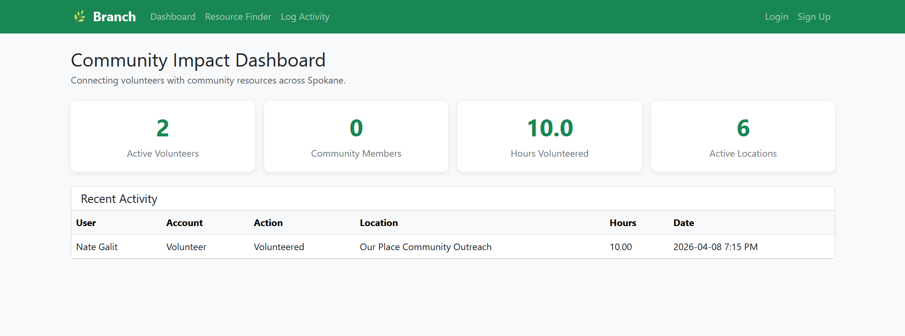
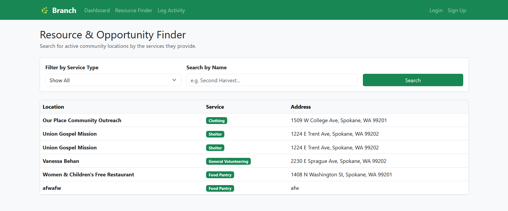
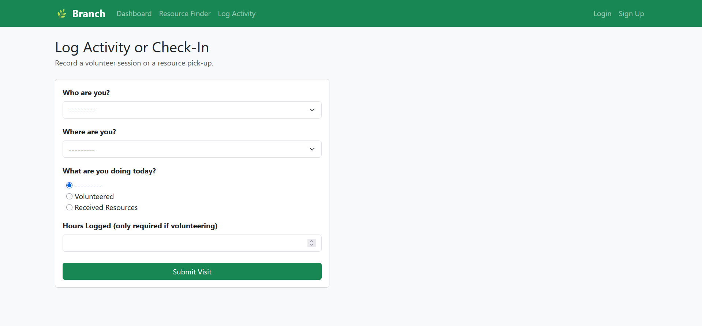
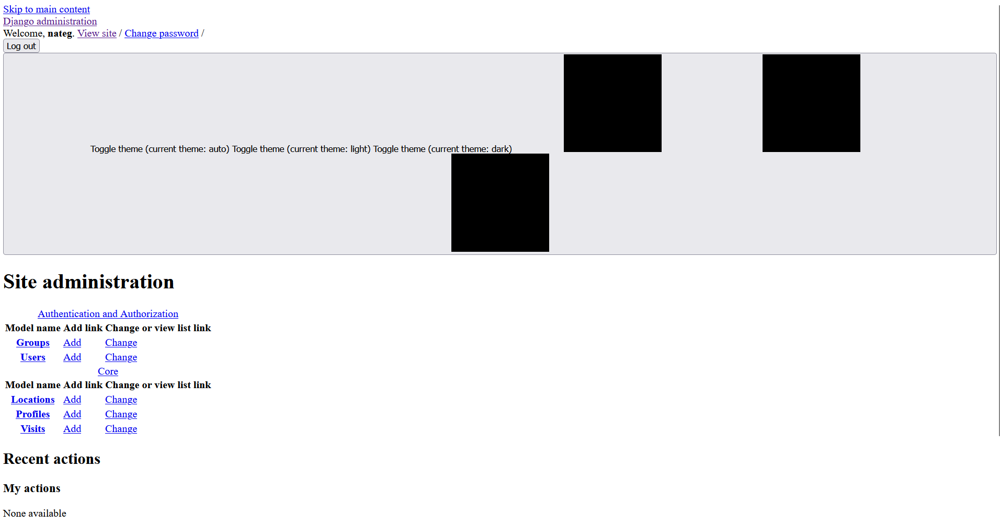
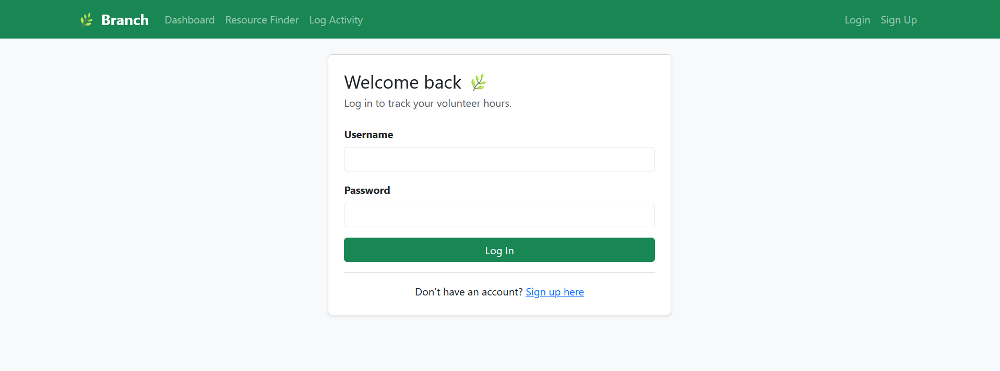
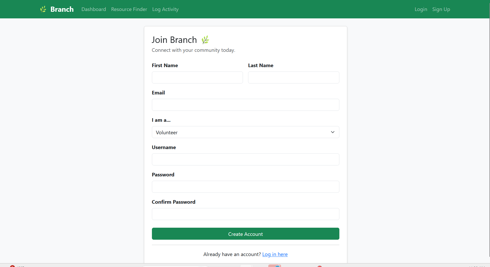

# 🌿 Branch | Community Connection Platform

**Live App:** https://branch-django.up.railway.app/  
**Original Streamlit Version:** https://branch-app.streamlit.app/  
**GitHub:** https://github.com/nategalit/branch-django

---

## What is Branch?

Branch is a community connection platform that bridges the gap between volunteers and people in need of resources across Spokane, WA. Volunteers use the app to find opportunities and log hours, while community members use it to locate essential services like food pantries, shelters, and clothing drives.

This Django version is a full rebuild of an original Streamlit prototype — adding real user authentication, a production-grade admin panel, and cloud deployment.

---

## Live Demo

| Page | URL |
|---|---|
| Dashboard | https://branch-django.up.railway.app/ |
| Resource Finder | https://branch-django.up.railway.app/resources/ |
| Log Activity | https://branch-django.up.railway.app/log/ |
| Sign Up | https://branch-django.up.railway.app/signup/ |
| Admin Panel | https://branch-django.up.railway.app/admin/ |

---

## Screenshots

### Dashboard


### Resource Finder


### Log Activity


### Admin Panel


### Login Page


### Sign Up Page


---

## What Changed: Streamlit → Django

| Feature | Streamlit Version | Django Version |
|---|---|---|
| User authentication | ❌ None | ✅ Full login/signup/logout |
| Admin interface | Built manually (Page 4) | ✅ Django admin (free, built-in) |
| Form validation | Manual `if` checks | ✅ Django ModelForms with `clean()` |
| Database queries | Raw SQL via psycopg2 | ✅ Django ORM |
| URL routing | File-based (`pages/`) | ✅ `urls.py` with named routes |
| Deployment | Streamlit Cloud | ✅ Railway (production-grade) |
| Templates | Python widgets | ✅ HTML templates with Bootstrap 5 |

---

## Tech Stack

- **Backend:** Python 3.14, Django 6.0
- **Database:** PostgreSQL (Neon.tech)
- **Frontend:** Bootstrap 5 (CDN)
- **Deployment:** Railway
- **Auth:** Django's built-in `django.contrib.auth`

---

## Database Schema

Three tables power the app:

**users** — Tracks both Volunteers and Community Members, storing contact info and gamification points (1 hour = 100 points).

**locations** — Stores active community resources (Food Pantries, Shelters, Clothing drives, General Volunteering) and their addresses.

**visits** — The junction table linking users and locations, tracking when a user volunteers or receives resources.

### Entity-Relationship Diagram


---

## Key Features

- **Community Impact Dashboard** — Live metrics showing total volunteers, community members, hours logged, and active locations. Recent activity feed with joined data across all three tables.
- **Resource Finder** — Filter locations by service type or search by name. Powered by Django ORM's `__icontains` lookup (equivalent to SQL `ILIKE`).
- **Log Activity** — Form with server-side validation: volunteers must log hours > 0, community members get hours set to null automatically. Successful volunteer submissions award points and update the user's total.
- **Gamification** — 100 points per volunteer hour, tracked on each user's profile.
- **Django Admin** — Full CRUD for Profiles, Locations, and Visits with search, filter, and list display. Replaces the manually-built "Manage Directory" page from the Streamlit version.
- **User Auth** — Signup creates both a Django `auth.User` and a linked `Profile` in one transaction. Login/logout with session management and password hashing handled by Django.

---

## How to Run Locally

### 1. Clone the repo
```bash
git clone https://github.com/nategalit/branch-django.git
cd branch-django
```

### 2. Create and activate a virtual environment
```bash
python -m venv venv

# Windows
.\venv\Scripts\Activate.ps1

# Mac/Linux
source venv/bin/activate
```

### 3. Install dependencies
```bash
pip install -r requirements.txt
```

### 4. Create a `.env` file in the project root
```
DB_NAME=your_db_name
DB_USER=your_db_user
DB_PASSWORD=your_db_password
DB_HOST=your_db_host
DB_PORT=5432
SECRET_KEY=your-secret-key
DEBUG=True
```

### 5. Run the development server
```bash
python manage.py runserver
```

Visit **http://localhost:8000**

---

## Project Structure

```
branch-django/
├── core/                        # Main Django app
│   ├── migrations/
│   ├── templates/
│   │   ├── core/
│   │   │   ├── base.html        # Shared navbar + layout
│   │   │   ├── dashboard.html   # Home page
│   │   │   ├── resource_finder.html
│   │   │   ├── log_activity.html
│   │   │   └── signup.html
│   │   └── registration/
│   │       └── login.html
│   ├── admin.py                 # Admin panel config
│   ├── forms.py                 # VisitForm + SignupForm
│   ├── models.py                # Profile, Location, Visit
│   ├── urls.py                  # URL routing
│   └── views.py                 # View functions
├── myapp/                       # Django project config
│   ├── settings.py
│   ├── urls.py
│   └── wsgi.py
├── .env                         # Local secrets (not committed)
├── .gitignore
├── Procfile                     # Railway deployment
├── railway.json                 # Railway config
├── requirements.txt
└── manage.py
```

---

## What I Learned

Moving from Streamlit to Django taught me how real web frameworks actually work:

- **Separation of concerns** — Models, views, templates, and URLs each have a specific job. In Streamlit everything runs top-to-bottom in one file; Django forces you to think in layers.
- **Django ORM vs raw SQL** — Writing `Profile.objects.filter(account_type='Volunteer').count()` is safer and more readable than raw psycopg2 queries, and handles SQL injection automatically.
- **Forms and validation** — Django's `ModelForm` and `clean()` methods replace manual `if` checks and make validation reusable and testable.
- **What frameworks are for** — Django's built-in admin, auth system, and CSRF protection are things I would have had to build from scratch in Streamlit. Frameworks exist so you can focus on your app's unique logic, not boilerplate security and CRUD.

---

## Reflection

The biggest challenge was deployment — specifically, discovering that PythonAnywhere's free tier blocks outbound PostgreSQL connections (port 5432). Debugging that required reading error logs, testing connectivity with curl, and ultimately switching to Railway, which has no such restrictions. This kind of environment-specific debugging is something you don't encounter in a classroom but is completely normal in real software development.

---

*Built as part of BMIS 444 — Project 1 | Gonzaga University*
